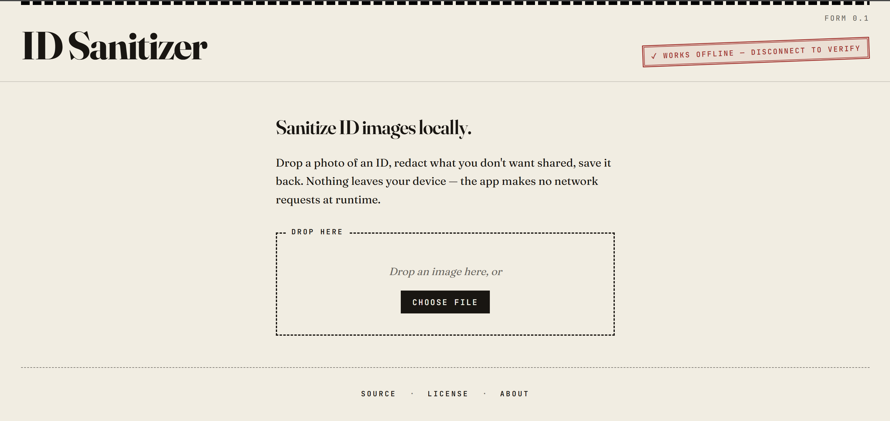

# ID Sanitizer

Redact personal info from photos of IDs — locally, in your browser, with no upload.

[](https://github.com/ceballosiker/id-sanitizer/actions/workflows/ci.yml)
[](./LICENSE)
[](https://ceballosiker.github.io/id-sanitizer/)
[](https://ceballosiker.github.io/id-sanitizer/)

> **Heads up:** This is free software I built for myself.
> No warranty, no guarantees — use at your own risk.
> Verify your redactions before sharing anything important.

**Live:** <https://ceballosiker.github.io/id-sanitizer/>



## What it is

ID Sanitizer is a single-page web app for blacking out sensitive fields on
photos of identity documents — driver's licenses, passports, ID cards, that
sort of thing — before you share them with someone who only needs to see
part of the document.

Drop an image, drag rectangles over what you don't want shared, download
the redacted version. The redacted pixels are flattened into the output
image — the original pixels are gone, not just hidden behind a layer.

## Privacy guarantee

Nothing leaves your device. The app makes no network requests at runtime;
your image is processed entirely in the browser. You can verify this:

- **Disconnect from the network** before uploading. Everything still works.
- **Open DevTools → Network tab.** No requests fire when you upload, draw,
  or download.
- **Inspect the source.** A strict CSP (`connect-src 'none'`) is enforced
  via `<meta>` in production — the browser refuses any outbound connection
  the app might try to make.
- **The PWA service worker** caches the app shell so you can use it
  offline indefinitely after one online visit.

## How to use

1. Open the [live URL](https://ceballosiker.github.io/id-sanitizer/) — or
   "Install App" if your browser supports PWAs (Chrome / Edge desktop +
   Android, Safari iOS via Add to Home Screen).
2. Drop an image (JPG / PNG / WebP) onto the page or click _Choose file_.
3. Click and drag to draw black rectangles over anything you want redacted.
4. Use Undo / Redo (or Ctrl/Cmd-Z, Ctrl/Cmd-Shift-Z) to fix mistakes.
5. Pick PNG (default) or JPEG and click _Download_. The redactions are
   baked into the output.

## Run it yourself

You don't have to trust this deployment. The whole point is the app makes
no network requests at runtime — and you can verify that by running it
locally from source.

```sh
git clone https://github.com/ceballosiker/id-sanitizer.git
cd id-sanitizer
npm install
npm run build
npm run preview
```

Open <http://localhost:4173/id-sanitizer/>. The strict CSP from production
is enforced; the service worker registers; everything runs exactly as it
would on the live site, but served from your own machine.

After the first build, even `npm install` and `npm run build` aren't
necessary — the `dist/` directory is a self-contained static site you can
serve with any file server (`python -m http.server`, `npx serve`, nginx,
whatever). No Node required at runtime.

## Develop locally

```sh
git clone https://github.com/ceballosiker/id-sanitizer.git
cd id-sanitizer
npm install
npm run dev
```

| Script                            | What it does                                         |
| --------------------------------- | ---------------------------------------------------- |
| `npm run dev`                     | Vite dev server with HMR on `http://localhost:5173/` |
| `npm run build`                   | Production build into `dist/`                        |
| `npm run preview`                 | Serve the production build locally on `:4173`        |
| `npm run typecheck`               | `tsc --noEmit`                                       |
| `npm run lint` / `lint:fix`       | ESLint                                               |
| `npm run format` / `format:check` | Prettier                                             |
| `npm run test:run`                | Vitest unit tests                                    |
| `npm run e2e`                     | Playwright e2e tests against the production build    |
| `npm run icons`                   | Regenerate PWA icons from `scripts/icon.svg`         |

After clone + `npm install`, the app runs fully offline — no CDN, no
remote fonts, no analytics. The bundled fonts (Fraunces, JetBrains Mono)
are self-hosted via [Fontsource](https://fontsource.org/).

## Tech stack

Vanilla TypeScript + Vite. No framework. ~10 KB JS bundle. Canvas 2D for
rendering, native Pointer Events for input, native `<dialog>` for the
About modal, [`vite-plugin-pwa`](https://vite-pwa-org.netlify.app/) for
the service worker + manifest.

## Contributing

Bug reports and small PRs welcome. For larger changes, open an issue
first to discuss the approach. The repo follows
[Conventional Commits](https://www.conventionalcommits.org/) and uses
release-please for versioned releases on the `main` branch.

## License

[MIT](./LICENSE) © 2026 Iker
